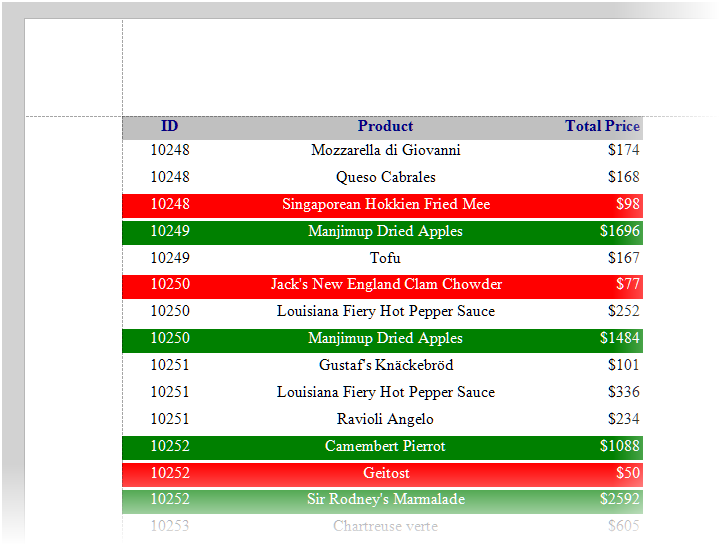

<!-- default badges list -->

<!-- default badges end -->
# Reporting for WinForms - Handle the BeforePrint Event to Change the Label Appearance

This example shows how to handle the `XRlabel.BeforePrint` event, how to access the label object in the event handler, and how to customize the appearance of the label.

> **Note**
> 
> Use [binding expressions](https://docs.devexpress.com/XtraReports/403357/detailed-guide-to-devexpress-reporting/use-expressions/expressions-overview) instead of the `BeforePrint` handler  to flexibly set values for most of the properties of the report controls.

## Files to Review

* [Form1.cs](./CS/Form1.cs) (VB: [Form1.vb](./VB/Form1.vb))
* [XtraReport1.cs](./CS/XtraReport1.cs) (VB: [XtraReport1.vb](./VB/XtraReport1.vb))

## Documentation

- [Use Report Controls](https://docs.devexpress.com/XtraReports/2605/detailed-guide-to-devexpress-reporting/use-report-controls)
- [Use Expressions](https://docs.devexpress.com/XtraReports/120091/detailed-guide-to-devexpress-reporting/use-expressions)
- [Report Events](https://docs.devexpress.com/XtraReports/7345/detailed-guide-to-devexpress-reporting/reporting-api/create-reports-in-code/report-events)

## More Examples

- [Reporting for WinForms - Getting Started](https://github.com/DevExpress-Examples/Reporting_getting-started-xtrareports-e5144)
- [How to obtain the current page number when printing a control](https://github.com/DevExpress-Examples/Reporting_how-to-obtain-the-current-page-number-when-printing-a-control-e1952)
- [Reporting for WinForms - Use Binding Expressions to Highlight Average Product Prices in Charts](https://github.com/DevExpress-Examples/reporting-binding-expressions-in-charts)
- [Aggregate Functions in Calculated Fields - Usage Example](https://github.com/DevExpress-Examples/reporting-aggregated-function-calculated-field)

